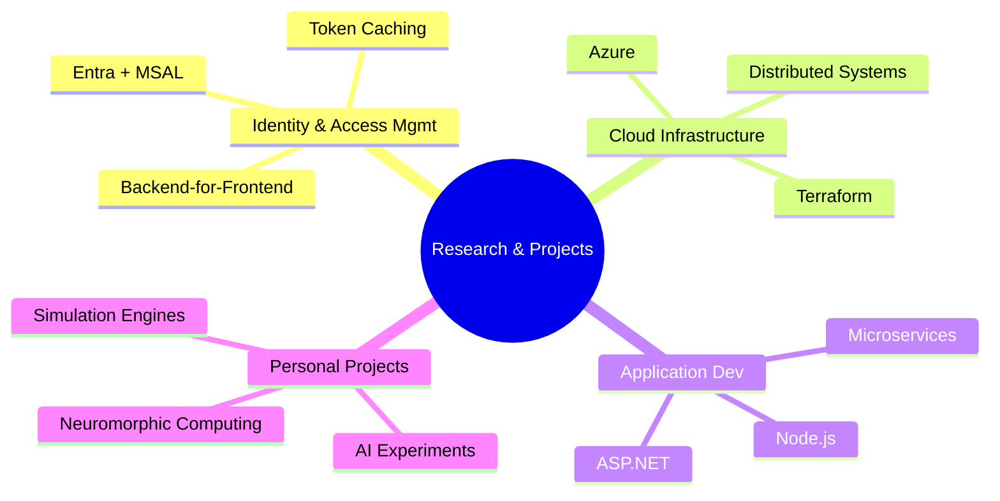

# Dylan Cozloff — Research & Projects

🚀 Welcome to the hub of my **research, projects, and technical papers**.  
This space serves as a living archive of my journey as a **software engineer**, spanning **cloud infrastructure, distributed systems, identity & access management, AI, and personal experiments in software engineering**.

---

## 🌐 My Focus Areas

:::tip
I don’t just write code — I **design systems**.  
This hub brings together insights from **application development, cloud-native architectures, security engineering, DevOps, and AI research**.
:::

---

## 📚 Featured Papers

Here are some of my recent deep dives:

- 🔑 [ASP.NET + Graph API — Fastest Entra Automation](./optimizing-entra-graph-api.md)  
  How I optimized Microsoft Entra **Graph API** calls with batching, parallelization, and a reusable identity microservice.

- 🔒 [MSAL Node + Redis — Token Cache & Session Management](./msal-node-redis-token-cache.md)  
  How I built a **Redis-backed MSAL cache** for secure, distributed authentication across multi-tenant container apps.

- ⚙️ [Terraform + Azure — Full Infrastructure Automation](./terraform-azure-infra-automation.md)  
  Standardized Terraform modules with remote state, enabling **global infra provisioning** from scratch.

---

## 🧑‍💻 About My Work

I specialize in building **scalable, secure, and observable systems** at the intersection of:

- 🌍 **Cloud Infrastructure** (Azure, Kubernetes, Terraform)
- 🔐 **Identity & Access Management** (Microsoft Entra, OAuth2/OIDC, MSAL)
- ⚡ **Application Engineering** (C#, .NET, Node.js, distributed microservices)
- 🧠 **Research Projects** (AI, simulation software, and neuromorphic computing explorations)

---

## 🌟 Why This Hub?

This isn’t just documentation — it’s a **launchpad**.

- For **engineers**, it’s a reference for solving complex problems in cloud, identity, and infra automation.
- For **myself**, it’s a living system of record — where I track **what I’ve built, tested, and proven works**.
- For **future collaborators**, it’s a way to see my **breadth of skills and versatility**.

---

## 🔭 Next Steps

- Explore the featured papers
- Follow ongoing **research projects** in cloud, AI, and distributed systems
- Reach out if you’re interested in **collaboration or discussion**

---

✨ **This hub is where software engineering meets experimentation.**  
I build not just to ship, but to **understand, optimize, and push boundaries**.
