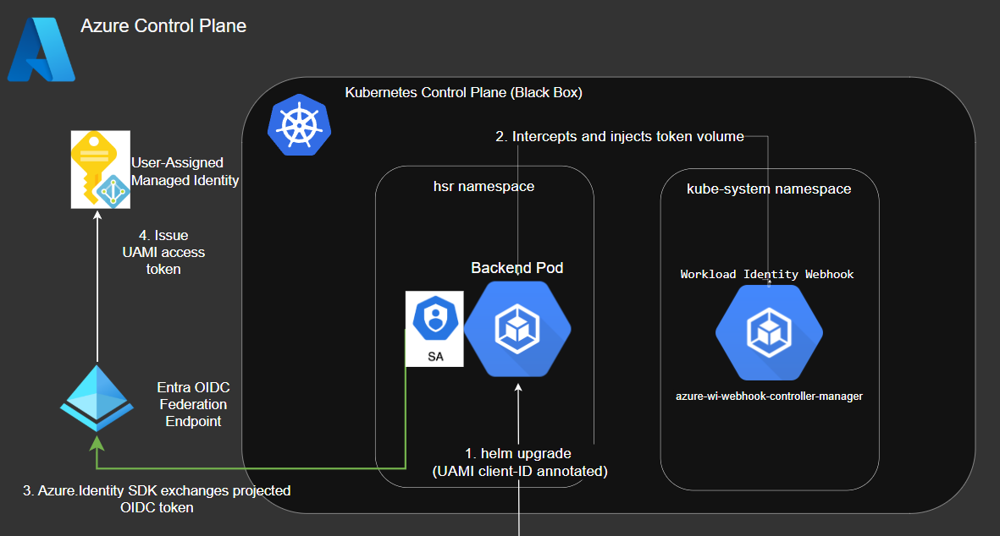

# Kubernetes-Azure Service Authentication



This document explains the process used to enable **service-to-service authentication** in AKS so that a backend pod can securely access **Azure Key Vault** to retrieve a certificate using **Azure Workload Identity**.

---

## 🚩 Challenge

Applications running inside AKS need to authenticate to Azure resources (e.g., Key Vault) without embedding secrets. The solution must:

- Use **User-Assigned Managed Identities (UAMI)** instead of secrets.
- Allow Kubernetes pods to impersonate these identities securely.
- Support end-to-end integration with Azure Key Vault.

---

## ⚡ Solution

We implemented **Azure Workload Identity Federation** between AKS and Azure Entra ID. The flow ensures that a backend pod can exchange its projected OIDC token for an Azure AD access token bound to a UAMI.

### Key Steps

1. **Workload Identity Federation**

   - Created Federated Identity Credentials (FIC) binding Kubernetes service accounts to UAMIs.

   Example for backend:

   ```hcl
   resource "azurerm_federated_identity_credential" "backend_fic" {
     name                = "fic-backend"
     resource_group_name = var.identity_rg_name
     parent_id           = data.azurerm_user_assigned_identity.backend_identity.id

     issuer   = azurerm_kubernetes_cluster.global_aks.oidc_issuer_url
     subject  = [CONFIDENTIAL]
     audience = ["api://AzureADTokenExchange"]
   }
   ```

2. **Namespace and Labels**

   - Configured namespace with the `azure.workload.identity/use=true` label to allow workload identity injection.

   ```hcl
   resource "kubernetes_namespace" "namespace" {
     metadata {
       name = [CONFIDENTIAL]
       labels = {
         "azure.workload.identity/use" = "true"
       }
     }
   }
   ```

3. **Helm Chart (Backend Pod)**

   - ServiceAccount annotated with UAMI client ID.

   ```yaml
   apiVersion: v1
   kind: ServiceAccount
   metadata:
     name: backend-sa
     namespace: hsr
     annotations:
       azure.workload.identity/client-id: { { .Values.backend.azureClientId } }
   ```

   - Deployment specifies the ServiceAccount and environment variables.

   ```yaml
   spec:
     serviceAccountName: backend-sa
     containers:
       - name: backend
         image: "{{ .Values.backend.image.repository }}:{{ .Values.backend.image.tag }}"
         env:
           - name: AZURE_CLIENT_ID
             value: "{{ .Values.backend.azureClientId }}"
   ```

4. **Token Exchange Flow**
   - Pod starts with SA annotated → webhook injects projected OIDC token.
   - Azure Identity SDK (`DefaultAzureCredential`) exchanges token with Entra OIDC Federation Endpoint.
   - UAMI access token is issued.
   - Backend pod uses this access token to authenticate to Key Vault and retrieve the certificate.

---

## Flow Diagram

1. Helm upgrade deploys backend pod with annotated ServiceAccount.
2. Workload Identity Webhook intercepts pod creation and injects projected token.
3. Azure SDK exchanges OIDC token with Entra federation endpoint.
4. Entra issues UAMI access token.
5. Backend pod calls Key Vault with UAMI token to fetch secrets/certificates.

---

## 🏆 Results

- No secrets stored in Kubernetes manifests.
- End-to-end identity lifecycle managed by Terraform.
- App runtime config handled via Helm.
- Clear separation of concerns:
  - **Terraform → Azure plane (identities, FIC, roles)**
  - **Helm → Kubernetes plane (ServiceAccounts, Deployments)**
