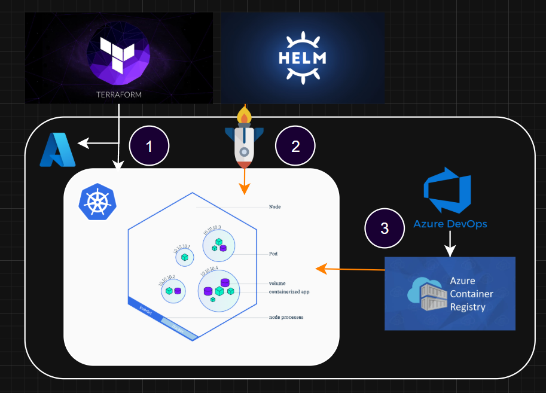
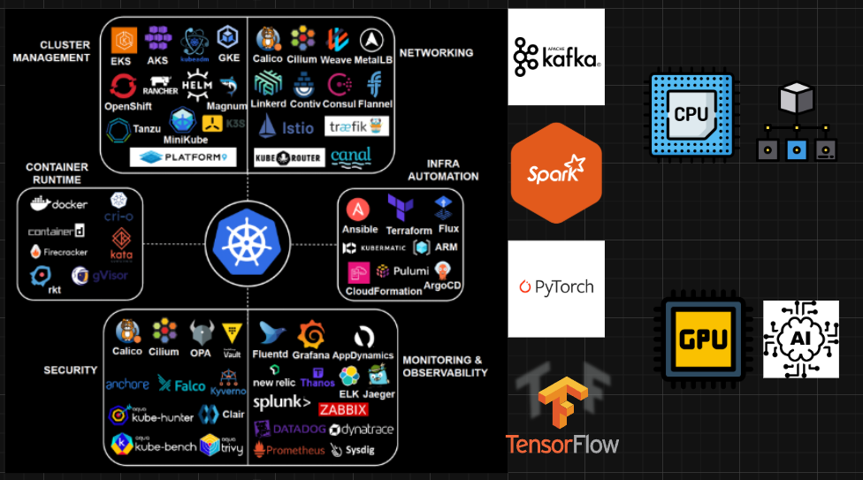
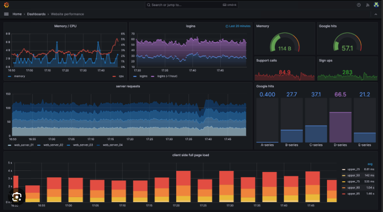
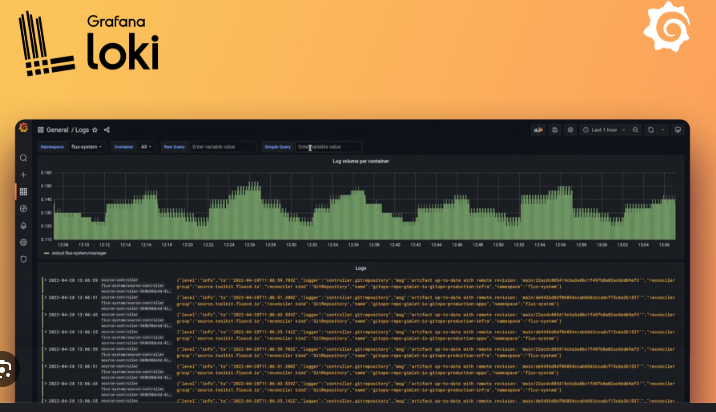
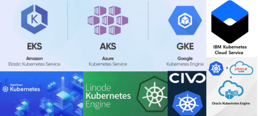

# Kubernetes + Terraform: Fully Automated Government Enterprise Architecture

Government systems demand **efficiency, reliability, security, portability, observability, and compliance**. While abstractions of such like Azure Container Apps (ACA) is a strong platform for lightweight, stateless microservices, Kubernetes offers the **enterprise-grade control and automation** that public sector workloads require.

Moreover, AKS unlocks a world of automated GitOps deployments and integrations that span the entire ecosystem — from data pipelines to observability stacks. These capabilities allow agencies to take open-source architectural templates and then re-configure infrastructure, security, and compliance rules once and have them enforced automatically with every deployment, ensuring consistent, repeatable, and auditable rollouts across environments. This automation not only accelerates the delivery of compute configurations but also raises confidence that systems remain secure, compliant, and resilient at scale.

---

## 1. GitOps, Templates, and Automated Deployments for Configurable Compute

Modern government agencies must manage complex compliance frameworks while delivering resilient systems. Kubernetes enables this through **GitOps workflows**, where infrastructure and application definitions live in version-controlled repositories. Every deployment, configuration change, or policy update flows through the same pipeline, producing a complete and auditable trail for compliance [GitOps With Helm](https://codefresh.io/blog/using-helm-with-gitops/).

With **Azure Kubernetes Service (AKS)**, agencies can start from **open-source architectural templates** — whether for data pipelines, observability stacks, or secure ingress controllers — and then adapt them to meet federal requirements. Tools like **Terraform** and **Helm** bridge the gap between infrastructure provisioning and workload deployment, allowing security controls and compliance guardrails to be defined once and consistently applied across environments [Search for Helm Charts](https://artifacthub.io/).

---

## 2. Observability & Logging Flexibility + Deep Cost/User Analytics

Enterprise systems cannot rely on a single monitoring backend. Kubernetes allows **pluggable observability**:

- Prometheus (Telemetry), Grafana (Monitoring), Loki (Logging), Tempo (Tracing) — all first-class citizens on AKS.
- Official Helm charts and Operators make installation repeatable and supported.  
  [Grafana Loki Helm](https://grafana.com/docs/loki/latest/installation/helm/?utm_source=chatgpt.com)

ACA, in contrast:

- Forces logs into Azure Monitor / Log Analytics only.
- Fixed to their dashboards, and limited metrics.
- Good for simple cases, but **limited query flexibility** (only KQL) and lacks portability if agencies need hybrid or multi-cloud observability.

---

## 3. Vendor Neutrality & Portability

ACA is an Azure-only service. Kubernetes is **cloud-agnostic** and supported across:

- Azure (AKS)
- AWS (EKS)
- GCP (GKE)
- On-prem (OpenShift, Rancher, K8s upstream)

For government, where **vendor lock-in is a strategic risk**, Kubernetes offers a safer long-term architecture.

---

## Conclusion

ACA is framed as **serverless containers** — a convenient platform for building and deploying modern apps at scale [ACA Overview](https://learn.microsoft.com/en-us/azure/container-apps/overview?utm_source=chatgpt.com). Kubernetes, however, is framed as a **general-purpose orchestration platform**, designed to power distributed systems with scaling, failover, and deployment flexibility at its core [Kubernetes official docs](https://kubernetes.io/docs/concepts/overview/?utm_source=chatgpt.com).

For government agencies, this distinction is critical. They need far more than a platform for “apps” — they require a **comprehensive digital infrastructure layer** that can host mission-critical, regulated, and stateful workloads.

Adopting Kubernetes is not just an incremental improvement; it represents a **revolution in how our organization manages compute**. By unifying automation, compliance, observability, and portability under a single, extensible orchestration layer, Kubernetes becomes the backbone for all enterprise IT. Instead of siloed platforms and app-centric abstractions, we gain a **cohesive, future-proof infrastructure fabric** — one capable of spanning clouds, enforcing NIST-aligned security controls, and supporting both modern microservices and legacy systems alike.

This is why Kubernetes is not just a platform, but the **foundation of our enterprise transformation**.

Summarizing the comparison:

| Requirement            | Kubernetes (AKS)                                     | Azure Container Apps (ACA)            |
| ---------------------- | ---------------------------------------------------- | ------------------------------------- |
| **Automation**         | ✅ GitOps, Terraform + Helm, repeatable              | ❌ Limited to ACA environment deploys |
| **Observability**      | ✅ Prometheus, Grafana, Loki, OpenTelemetry          | ❌ Azure Monitor only                 |
| **Portability**        | ✅ Cloud-agnostic                                    | ❌ Azure-only                         |
| **Critical workloads** | ✅ Databases, logging, middleware, stateful services | ⚠️ Stateless microservices only       |

---
