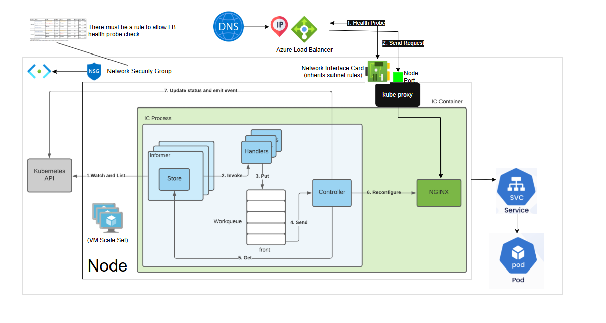

# Kubernetes Setup (Ingress, TLS, Authentication, Deployments)



This document summarizes the end-to-end setup of **Kubernetes on Azure (AKS)** with a focus on **NGINX Ingress Controller**, **TLS termination with cert-manager**, **Helm-based application deployments**, and **workload identity integration**.

---

## 🚩 Challenge

Exposing mission-critical applications on AKS to the internet required more than just deploying pods:

- We needed a **reliable Terraform backend** to manage state and ensure reproducibility across environments.
- Workloads had to pull images securely from **Azure Container Registry (ACR)** using managed identities.
- Applications needed to be exposed through an **Ingress Controller** with load balancing, SSL/TLS termination, and DNS routing.
- **Workload identity** had to be enabled for secure, secretless access to Azure resources.
- The cluster needed to pass Azure’s **health probe checks** and align with **NSG (Network Security Group) rules**.
- Finally, we required **cert-manager** to automate certificate issuance and renewal for production-ready TLS endpoints.

Together, these requirements formed a **full-scale enterprise challenge**: building a Kubernetes foundation that is not just functional, but also **secure, repeatable, and compliant** with cloud and government-grade standards.

---

## ⚡ Solution

### 1. Terraform State

Create a `tfstate` blob to hold the AKS Terraform state in the global tfstate hub:

```hcl
resource "azurerm_storage_container" "aks_tfstate" {
  name                  = "aks-tfstate"
  storage_account_id    = data.azurerm_storage_account.global.id
  container_access_type = "private"
}
```

### 2. Provision AKS

Use the tfstate blob as the Terraform backend and provision AKS.

```hcl
# Ex. The cluster
resource "azurerm_kubernetes_cluster" "global_aks" {
  ...
  default_node_pool {
    ...
    node_count = 1
    vm_size    = "Standard_D2_v2"
    ...
  }

  identity {
    type = "SystemAssigned"
  }

  # Required for Azure Workload Identity FIC
  oidc_issuer_enabled       = true
  workload_identity_enabled = false # set to false so that we can use a custom webhook
  ...
}
```

### 3. Configure ACR Access

Grant the **AKS kubelet identity** `AcrPull` into the control plane so workloads can pull from ACR.

```hcl
resource "azurerm_role_assignment" "aks_acr_pull" {
  principal_id         = azurerm_kubernetes_cluster.global_aks.kubelet_identity[0].object_id
  role_definition_name = "AcrPull"
  scope                = data.azurerm_container_registry.acr.id
}
```

### 4. Install `kubectl`

Helm relies on `kubectl` to talk to Kubernetes.

```pwsh
kubectl version --client
winget install Kubernetes.kubectl
```

### 5. Deploy NGINX Ingress Controller via Helm

Add the official Helm repo and deploy ingress-nginx:

```pwsh
winget install Helm.Helm
helm repo add ingress-nginx https://kubernetes.github.io/ingress-nginx
helm repo update
az aks get-credentials --resource-group rg-global-001 --name aks-global-qa-westus-001
```

Check cluster nodes:

```pwsh
kubectl get nodes
```

Deploy ingress:

```pwsh
helm upgrade --install ingress-nginx ingress-nginx/ingress-nginx   --namespace ingress-nginx --create-namespace
```

Confirm controller is running:

```pwsh
kubectl get pods -n ingress-nginx
kubectl get svc -n ingress-nginx
```

### 6. Configure Custom Workload Identity ([My Docs](./kubernetes-az-auth.md))

- Ensure namespace and pod are labeled for workload identity.
- Admission enforcer must not disable pod mutation (`admissions.enforcer/disabled: "false"`).
- Disable Azure’s default workforce ID in Terraform and use a **custom Helm chart** to override defaults.
- [My Docs](./kubernetes-az-auth.md)
- [Microsoft Docs](https://learn.microsoft.com/en-us/azure/aks/workload-identity-deploy-cluster)

### 7. Deploy Applications via Helm

Define frontend/backend images in `values.yaml`:

```yaml
image:
  repository: [CLASSIFIED]/frontend
  tag: 1.0.0

backendImage:
  repository: [CLASSIFIED]/backend
  tag: 1.0.0
```

Deploy apps:

```pwsh
helm upgrade --install hsr-apps .  --namespace hsr --create-namespace  -f values.yaml -f values.secret.yaml
```

Verify pods and services:

```pwsh
kubectl get pods -n hsr
kubectl get svc -n hsr
kubectl get ingress -n hsr
```

### 8. NSG + Health Probe Fix

Patch the NGINX Service for Azure LB health probes:

```pwsh
kubectl annotate svc ingress-nginx-controller -n ingress-nginx   service.beta.kubernetes.io/azure-load-balancer-health-probe-request-path=/healthz
```

Open ports for Load Balancer to get past NSG in Terraform:

```hcl
resource "azurerm_network_security_rule" "allow_nodeports" {
  ...
  access                      = "Allow"
  protocol                    = "Tcp"

  # Health probes always come from Azure’s Load Balancer service tag
  source_address_prefix       = "AzureLoadBalancer"

  destination_port_ranges     = [CLASSIFIED]

  # Apply to all nodes in the NSG
  destination_address_prefix  = "*"
  ...
}

```

### 9. DNS Wiring

Assign a temporary DNS label:

```pwsh
az network public-ip update  --resource-group MC_rg-global-001_aks-global-qa-westus-001_westus2  --name kubernetes-a7986089cf09c485487f63da9836f4fc  --dns-name hsrqa-test
```

### 10. TLS with cert-manager

Install cert-manager CRDs and configure a ClusterIssuer:

```pwsh
kubectl apply -f https://github.com/cert-manager/cert-manager/releases/download/v1.15.1/cert-manager.crds.yaml
helm dependency update .
```

**ClusterIssuer:**

```yaml
apiVersion: cert-manager.io/v1
kind: ClusterIssuer
metadata:
  name: letsencrypt-prod
spec:
  acme:
    server: https://acme-v02.api.letsencrypt.org/directory
    email: { { .Values.certManager.email } }
    privateKeySecretRef:
      name: letsencrypt-prod
    solvers:
      - http01:
          ingress:
            class: nginx
```

**Ingress:**

```yaml
apiVersion: networking.k8s.io/v1
kind: Ingress
metadata:
  name: [APP NAME]-ingress
  annotations:
    kubernetes.io/ingress.class: nginx
    cert-manager.io/cluster-issuer: letsencrypt-prod
spec:
  tls:
    - hosts:
        - [APP NAME].cloudapp.azure.com
      secretName: [APP NAME]-tls
  rules:
  ...

```

Finally, re-deploy the helm upgrade

Verify:

```pwsh
kubectl get clusterissuer letsencrypt-prod
kubectl describe certificate hsrqa-tls -n hsr
kubectl describe ingress hsr-ingress -n hsr
```

---

## 🏆 Results

- ✅ AKS cluster provisioned with Terraform
- ✅ NGINX Ingress Controller deployed via Helm
- ✅ Frontend + Backend apps deployed from ACR
- ✅ NSG and LB probe configured
- ✅ DNS and TLS termination working with cert-manager
- ✅ Ingress routes for frontend and backend accessible via FQDN
