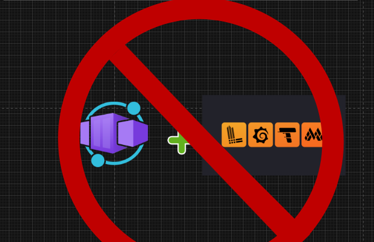
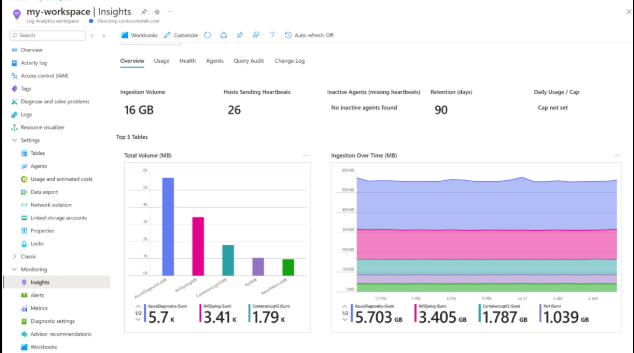
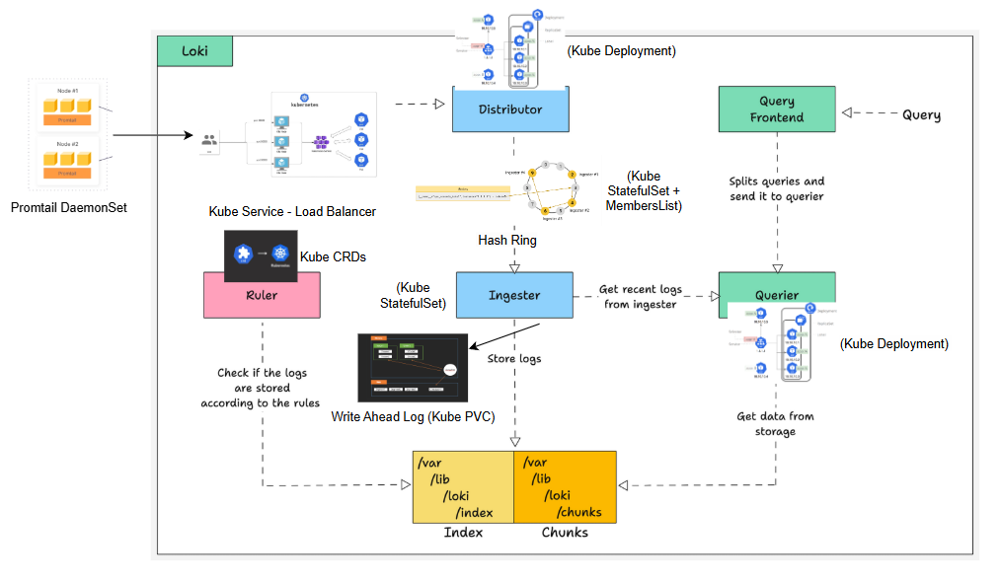

# Grafana-Loki Incompatible on Azure Container Apps

Azure Container Apps (ACA) has its own **built-in logging and monitoring stack** that streams logs to **Azure Monitor / Log Analytics**. This stack is **reliable and durable** but ACA ties you into this model. It may not as configurable or flexible as running your own Grafana-Loki stack — but it **ACTUALLY WORKS** in ACA’s architecture, because it was designed to.

Trying to run Loki-Grafana inside ACA is a **fundamental mismatch**. Here’s why:

---

## Option 1: ACA Logging: Built-in Reliability

From Microsoft’s own documentation:

- **Logs are sent to a Log Analytics Workspace** which runs on **Azure Data Explorer (Kusto)**, the same backend that powers Azure Monitor. ([Overview of Log Analytics](https://learn.microsoft.com/en-us/azure/azure-monitor/logs/log-analytics-overview?utm_source=chatgpt.com))
- **Persistence is guaranteed** by replication across storage nodes, with retention configurable between 30–730 days. ([Data retention in Azure Monitor Logs](https://learn.microsoft.com/en-us/azure/azure-monitor/logs/data-retention-archive?utm_source=chatgpt.com))
- Logs are **queryable with KQL** (Kusto Query Language), giving analysts and developers a full query language to work with at any time.

**This means**: even though ACA itself is stateless, once logs are forwarded to Azure Monitor they are **durably stored, queryable, and safe**. ACA’s logging works out-of-the-box and does not require you to manage ingestion pipelines, WAL recovery, or data replication.

---

# Why Loki on Azure Container Apps Is Unreliable

I’m certain about the **reliability gap** between Loki’s design and ACA’s capabilities, because both Grafana and Microsoft’s docs spell out what each platform supports.

- Loki is built assuming **Kubernetes-style primitives**.
- ACA deliberately does **not** expose those — it’s an abstraction of Kubernetes for **stateless workloads**.
- Grafana Loki is **easily implemented and recommended via Helm charts** on Kubernetes, with official support for installation, scaling, and upgrades. The Helm ecosystem gives you a battle-tested deployment model that ACA cannot replicate. The alternative is manually configuring everything on Azure Container Apps.
  [Grafana Helm Charts for Loki](https://grafana.com/docs/loki/latest/installation/helm/?utm_source=chatgpt.com)

---

# Details:

## 1. Loki Requires WAL Persistence on Stable Storage

Loki’s **WAL (Write Ahead Log)** is written to the local filesystem before acknowledging writes. This protects against crashes.

**Loki docs:**

> “The WAL in Grafana Loki records incoming data and stores it on the local file system in order to guarantee persistence of acknowledged data in the event of a process crash. Upon restart, Loki will ‘replay’ all of the data in the log.”  
> [Grafana Loki WAL docs](https://grafana.com/docs/loki/latest/operations/storage/wal/?utm_source=chatgpt.com)

**Problem in ACA:**  
ACA’s ephemeral storage is deleted when a container or replica stops.

**ACA docs:**

> “The storage is temporary and disappears when the container is shut down or restarted.”  
> [ACA storage mounts](https://learn.microsoft.com/en-us/azure/container-apps/storage-mounts?utm_source=chatgpt.com&tabs=smb&pivots=azure-cli)

That means WAL data will be wiped on restarts. No StatefulSet or PVC to guarantee the ingester reattaches to the same WAL.

---

## 2. ACA Storage = Azure Files = Network Latency and IOPS ceiling

ACA does let you mount **Azure Files** for persistence.

**ACA docs:**

> “Azure Files storage has the following characteristics: Files written under the mount location are persisted to the file share.”  
> [ACA storage mounts – Azure Files](https://learn.microsoft.com/en-us/azure/container-apps/storage-mounts?utm_source=chatgpt.com&tabs=smb&pivots=azure-cli)

**Problem in ACA:**

The problem isn’t feasibility — it’s **operational reliability**:

2a. **Performance mismatch**

- Loki’s WAL is lots of small sequential writes.
- Azure Files (SMB/NFS) is network-backed storage with [throughput/IOPS ceilings](https://learn.microsoft.com/en-us/azure/storage/files/storage-files-scale-targets).
- If ingestion volume spikes, Azure Files latency will bottleneck.

2b. **Network dependency**

- WAL writes are no longer local, but depend on network stability.
- A transient SMB disconnect = WAL corruption risk or data loss.
- This is why Loki normally expects a local PVC with block storage (e.g., Azure Disk).

2c. **No Stateful Lifecycle Management**

- Even if WAL survives, ACA doesn’t give you StatefulSets or pod identity.
- If replicas scale up/down, Loki’s ingester shards may not map cleanly back to the WAL they wrote.

2d. **Grafana’s own guidance**

- Loki docs explicitly mention WAL + **StatefulSet with fixed volumes** as the reference deployment.
- That’s Kubernetes, not ACA.  
  [Grafana Loki WAL deployment changes](https://grafana.com/docs/loki/latest/operations/storage/wal/?utm_source=chatgpt.com)

---

## 3. Loki Needs Coordinated Components & Hash Rings

Loki ingesters, distributors, and queriers use **consistent hash rings** for sharding.

**Loki docs:**

> “Consistent hash rings are incorporated into Loki cluster architectures … to shard log lines, enable horizontal scaling, and provide high availability.”  
> [Loki hash rings](https://grafana.com/docs/loki/latest/get-started/hash-rings/?utm_source=chatgpt.com)

**Problem in ACA:**

- ACA scales replicas independently.
- No control over pod identity or stable networking for hash rings.

**Loki docs:**

> “Since ingesters need to have the same persistent volume across restarts/rollout, all the ingesters should be run on StatefulSet with fixed volumes.”  
> [Grafana Loki WAL – Deployment changes](https://grafana.com/docs/loki/latest/operations/storage/wal/?utm_source=chatgpt.com)

ACA can’t guarantee stable component coordination.

---

## 4. ACA Itself is Positioned for Stateless Apps

Microsoft’s own positioning of ACA:

> “Azure Container Apps is a fully managed serverless container service for building and deploying modern apps at scale. Use it for microservices, APIs, and event-driven processing.”  
> [ACA Overview](https://learn.microsoft.com/en-us/azure/container-apps/overview?utm_source=chatgpt.com)

ACA is meant for **stateless microservices**, not **stateful log databases**. Loki is inherently stateful.

---

## The Choice in Front of Us

So we have two realistic paths forward:

1. **Commit fully to ACA’s built-in monitoring stack (Azure Monitor + Log Analytics + KQL)**. It is reliable and supported, even if less flexible.
2. **Commit fully to Kubernetes (AKS)** and run Loki the way it was designed: with Persistent Volumes, StatefulSets, Helm charts, and operators managing reliability.

Anything in between is half-measure, and **half-measures in logging = unreliability in court**. This app will likely be scrutinized legally, and we cannot afford gaps in our logs.

**_SPOILER_**: I already implemented Kubernetes deployment. 😝

---
